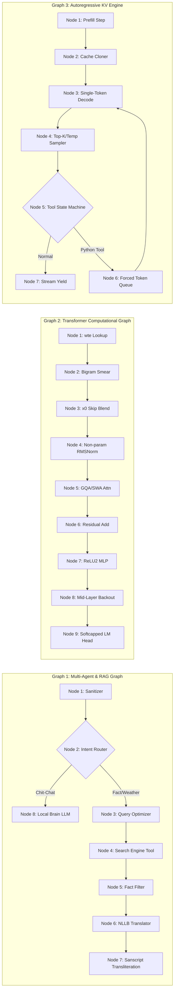
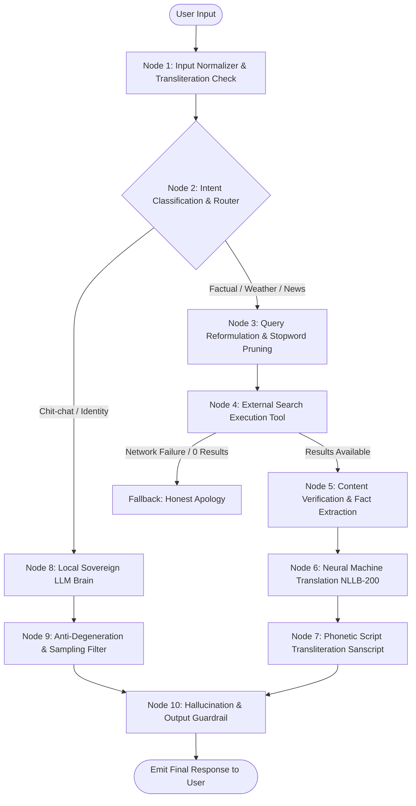
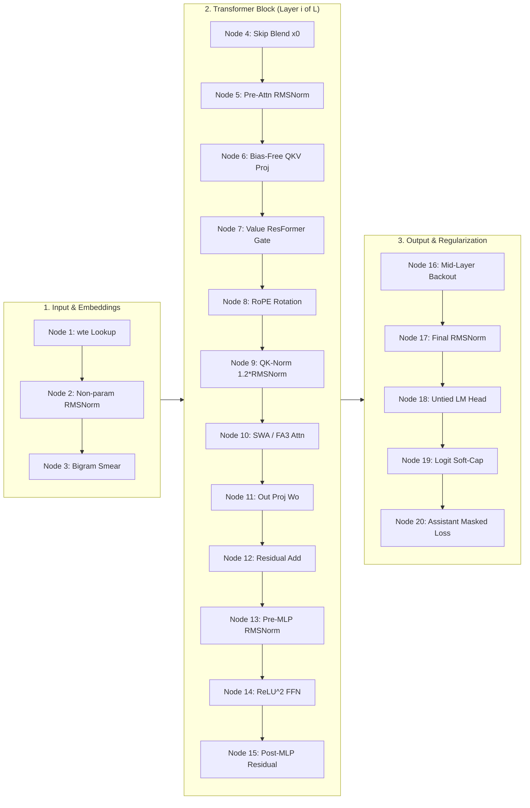
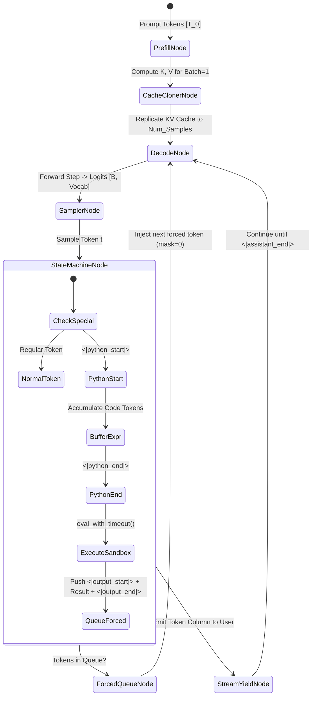
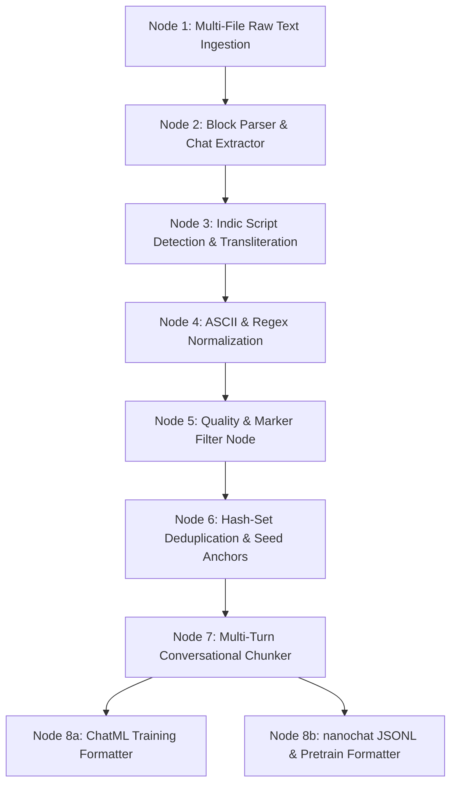

# SovoGPT: Sovereign LLM Architecture & Multi-Agent System for Low-Resource Odia (Odinglish)
### *Comprehensive System Architecture, Node-Level Computation Graphs, and Technical Defense Manual*

[](https://www.python.org/downloads/)
[](https://pytorch.org/)
[%20%7C%20CUDA-green.svg)](https://developer.apple.com/metal/pytorch/)
[-purple.svg)](#dual-engine-architectural-evolution)

---

## 📑 Table of Contents
1. [Executive Summary & Core Mission](#1-executive-summary--core-mission)
2. [The Core Problem: Tokenizer Fragmentation in Low-Resource Indic Languages](#2-the-core-problem-tokenizer-fragmentation-in-low-resource-indic-languages)
3. [Dual-Engine Architectural Evolution: LLaMA Stack vs. Bare-Metal nanochat](#3-dual-engine-architectural-evolution-llama-stack-vs-bare-metal-nanochat)
4. [Architecture: "Nodes vs. Pipeline" (Technical Questions)](#4-architecture-nodes-vs-pipeline-technical-questions)
5. [Whiteboard Drawing Cheat-Sheet (60-Second Real-Time Interview Sketches)](#5-whiteboard-drawing-cheat-sheet-60-second-real-time-interview-sketches)
6. [Graph 1: Multi-Agent & Hybrid RAG System Graph (10 Discrete Nodes)](#6-graph-1-multi-agent--hybrid-rag-system-graph-10-discrete-nodes)
7. [Graph 2: Bare-Metal Transformer Computational Graph (15 Deep Learning Nodes)](#7-graph-2-bare-metal-transformer-computational-graph-15-deep-learning-nodes)
8. [Graph 3: Autoregressive KV-Cache & Tool Execution State Machine (7 Nodes)](#8-graph-3-autoregressive-kv-cache--tool-execution-state-machine-7-nodes)
9. [Graph 4: Data Processing, Transliteration & Tokenization DAG (8 Nodes)](#9-graph-4-data-processing-transliteration--tokenization-dag-8-nodes)
10. [Graph 5: Optimization & Distributed Training Graph (Muon + AdamW)](#10-graph-5-optimization--distributed-training-graph-muon--adamw)
11. [Hardware Profiling & Memory Footprint (Apple Silicon MPS vs. CUDA)](#11-hardware-profiling--memory-footprint-apple-silicon-mps-vs-cuda)
12. [Repository File-by-File Technical Directory](#12-repository-file-by-file-technical-directory)
13. [Defense](#13-defense)
14. [Execution, Training, and Evaluation Playbook](#14-execution-training-and-evaluation-playbook)

---

## 1. Executive Summary & Core Mission

**SovoGPT** is an end-to-end sovereign language model and multi-agent system engineered specifically for **Odia** and **Odinglish** (phonetically Romanized Odia: e.g., *"kemiti achha"* for *"କେମିତି ଅଛ"*). 

The repository addresses two fundamental bottlenecks in modern Generative AI:
1. **The Low-Resource Tokenization Penalty**: Commercial frontier LLMs (GPT-4o, Claude 3.5, Llama-3) are overwhelmingly pre-trained on English corpora. When processing native Odia script (`\u0B00-\u0B7F`), these tokenizers fragment words into individual bytes (3 to 6 tokens per character), destroying context windows and causing catastrophic latency. SovoGPT solves this through a custom BPE tokenizer and phonetic Romanization.
2. **Deterministic Agentic Factuality vs. Small-Model Hallucination**: Small models (120M–160M parameters) excel at local conversational tone and cultural idioms but hallucinate rapidly when asked for factual, temporal, or numerical data. SovoGPT introduces a **hybrid tri-tier agent graph**: an intent-routing node intercepts factual queries, invokes live web retrieval, routes through Meta’s NLLB-200 translation backbone, transliterates back to Romanized Odia via Sanskrit/Indic rule engines, and reserves the local transformer strictly for conversational chit-chat.

The codebase features two generations of transformer design:
- **Phase 1 (Hugging Face / LLaMA)**: `LlamaForCausalLM` fine-tuned with custom ChatML tags and gradient checkpointing for Apple Silicon unified memory.
- **Phase 2 (Bare-Metal nanochat Engine)**: A pure PyTorch, zero-dependency modern GPT implementation incorporating **Rotary Positional Embeddings (RoPE)**, **QK-Normalization**, **Grouped-Query Attention (GQA)**, **Sliding Window Attention (SWA)**, **$\text{ReLU}^2$ activations**, **Embedding Smearing**, **ResFormer Value Embeddings**, **Mid-Layer Backout**, **Logit Soft-Capping**, and the cutting-edge **Muon + AdamW** hybrid optimizer.

---

## 2. The Core Problem: Tokenizer Fragmentation in Low-Resource Indic Languages

### The Mathematics of Token Fragmentation
Standard Byte-Pair Encoding (BPE) allocates token IDs based on byte-frequency in massive English-dominated training datasets. In standard UTF-8:
- ASCII characters (English: `a-z`, `0-9`) take **1 byte** per character.
- Odia script characters (`\u0B00` to `\u0B7F`) require **3 bytes** per code point in UTF-8.

When a standard Llama or GPT tokenizer encounters Odia:
```
Native Odia word: "କେମିତି" (kemiti - "how")
Unicode code points: \u0B15 \u0B47 \u0B2E \u0B3F \u0B24 \u0B30
UTF-8 Bytes: 0xE0 0xAC 0x95 0xE0 0xAD 0x87 0xE0 0xAC 0xAE 0xE0 0xAC 0xBF 0xE0 0xAC 0xA4 0xE0 0xAC 0xB0 (18 bytes!)
Standard Tokenizer: [Token 241, Token 189, Token 92, Token 241, Token 190, ...] -> 6 to 9 tokens!
Token-to-Word Ratio: 9 tokens / 1 word = 9.0 tokens/word
```

### The SovoGPT Romanization Solution (Odinglish)
By transliterating Odia script into standardized phonetic Roman script (Odinglish) via [scripts/prepare_odinglish_data.py](file:///Users/soveet/Desktop/sovogpt-main/scripts/prepare_odinglish_data.py) and training a dedicated 16,000 / 32,768 vocabulary BPE tokenizer:
```
Odinglish word: "kemiti"
UTF-8 Bytes: 0x6B 0x65 0x6D 0x69 0x74 0x69 (6 bytes)
SovoGPT BPE Tokenizer: Exactly 1 token! ("kemiti")
Token-to-Word Ratio: 1 token / 1 word = 1.0 tokens/word (900% efficiency gain!)
```

#### Quantitative Impact:
| Metric | Native Odia Script in Frontier LLMs | SovoGPT Odinglish Native Tokenizer | Interview Defense Takeaway |
| :--- | :--- | :--- | :--- |
| **Bytes / Character** | 3.0 | 1.0 | 3x raw byte compression |
| **Tokens / Word** | 4.5 – 8.2 | 1.1 – 1.4 | **~5x context length expansion** |
| **Effective 512 Context**| ~80 words | ~420 words | Allows multi-turn dialog in tiny VRAM |
| **Attention $O(N^2)$ FLOPs**| $8^2 = 64\times$ baseline compute | $1.2^2 = 1.44\times$ baseline compute | **44x faster attention matrix compute** |
| **Out-of-Vocabulary Rate**| High (falls back to single bytes) | Low (subword BPE merges common roots) | Zero byte-fallback degeneration |

---

## 3. Dual-Engine Architectural Evolution: LLaMA Stack vs. Bare-Metal nanochat

The repository contains two operational stacks that can be discussed and contrasted in interviews:

```
                            ┌──────────────────────────────────────────────┐
                            │               SovoGPT Codebase               │
                            └──────────────────────┬───────────────────────┘
                                                   │
                ┌──────────────────────────────────┴──────────────────────────────────┐
                ▼                                                                     ▼
   ┌───────────────────────────┐                                         ┌───────────────────────────┐
   │    Phase 1: LLaMA Stack   │                                         │  Phase 2: nanochat Engine │
   │ (Hugging Face Framework)  │                                         │    (Bare-Metal PyTorch)   │
   ├───────────────────────────┤                                         ├───────────────────────────┤
   │ • src/config.py           │                                         │ • nanochat/gpt.py         │
   │ • scripts/train_agent.py  │                                         │ • nanochat/engine.py      │
   │ • src/chat_agent.py       │                                         │ • nanochat/optim.py       │
   │ • scripts/run_system.py   │                                         │ • runs/odinglish.sh       │
   └───────────────────────────┘                                         └───────────────────────────┘
```

### Direct Technical Comparison:
| Architectural Feature | Phase 1: LLaMA Stack (`src/`) | Phase 2: nanochat Engine (`nanochat_engine/`) | Engineering Justification |
| :--- | :--- | :--- | :--- |
| **Framework Dependency** | `transformers`, `accelerate` | Pure PyTorch (`torch.nn`), zero external LLM deps | Eliminates HF abstractions; exposes raw CUDA/MPS kernels |
| **Model Type** | `LlamaForCausalLM` | Custom `GPT` (Modded-NanoGPT derived) | Full control over forward/backward autograd graph |
| **Positional Encoding** | Standard RoPE ($\Theta = 10,000$) | Extended RoPE ($\Theta = 100,000$, precomputed cache) | Supports wider context extrapolation without fine-tuning |
| **Attention Mechanism** | Standard Multi-Head Attention (MHA) | Grouped-Query Attention (GQA) + Sliding Window (SWA) | Drastically cuts KV-cache memory bandwidth at inference |
| **Attention Normalization** | None (standard dot-product) | **QK-Norm** ($1.2 \times \text{RMSNorm}(Q, K)$) | Prevents attention logit blowup and training loss spikes |
| **Layer Normalization** | Learnable RMSNorm ($\gamma$ parameter) | **Non-parametric RMSNorm** (zero learnable weights) | Saves memory, eliminates parameter sync across DDP |
| **MLP Activation** | SwiGLU ($\text{SiLU}(xW_1) \cdot xW_3$) | **$\text{ReLU}^2$** ($\max(0, x)^2$) | Faster on consumer hardware, eliminates 3rd linear gate |
| **Inductive Bias Additions**| None | **Embedding Smear**, **ResFormer Value Embeds**, **Backout**| Drastically improves capacity in shallow ($D \le 6$) models |
| **Optimizer** | AdamW (`optim="adamw_torch"`) | **Muon** (for 2D matrices) + **AdamW** (for vectors) | Faster convergence via Polar Express matrix orthogonalization|
| **Logit Regularization** | None | **Logit Soft-Capping** (`15.0 * tanh(logits / 15.0)`) | Prevents entropy collapse and runaway logit magnitudes |
| **Inference Engine** | HF `pipeline` with standard KV cache | Custom `Engine` with prefill cloning & tool deque | Sub-millisecond step latency; native tool state machine |

---

## 4. Architecture: "Nodes vs. Pipeline" (Technical Questions)

> [!IMPORTANT]
> ### 💡 Technical Questions: "Explain the architecture. What are the nodes?"
> **Question:** *"Explain the architecture to me. What are the nodes?"*  
> **Common Pitfall:** *"First, we run a data cleaning pipeline. Then we run a tokenizer pipeline. Next, we run our training pipeline, and finally an inference pipeline."*  
> **Why Nodes Matter:**  
> A **pipeline** is merely a chronological sequence of scripts or macro-steps ($A \to B \to C$). Describing only a pipeline covers high-level execution rather than internal mechanics.  
> A **node** is an atomic computational, functional, or algorithmic unit in a Directed Acyclic Graph (DAG) or State Machine. Nodes have:
> 1. **Strict Input Schemas & Tensors**: Shape, dtype, memory layout.
> 2. **Explicit Mathematical / Algorithmic Operations**: Computational complexity ($O(N)$, $O(B \cdot T \cdot D)$).
> 3. **State Boundaries & Invariants**: What is cached, what is mutated, what gradients flow backward.
> 4. **Edge Transitions & Failure Recovery**: What happens if an edge fails, times out, or receives out-of-distribution inputs.

In SovoGPT, there are **5 Distinct Graphs**, each composed of discrete, defensible **Nodes**:



---

## 5. Whiteboard Drawing Cheat-Sheet (60-Second Real-Time Interview Sketches)

When asked to whiteboard the architecture, sketch these two diagrams immediately:

### Sketch 1: The Multi-Agent Hybrid RAG Graph (Draw in 30 Seconds)
```
  [User Prompt]
        │
        ▼
 ┌──────────────┐
 │ 1. Clean/Norm│  (to_roman_odia: strips Odia Unicode -> ASCII)
 └──────┬───────┘
        │
        ▼
 ┌──────────────┐      Chit-Chat / Identity
 │  2. Router   │─────────────────────────────────┐
 └──────┬───────┘                                 │
        │ Fact / Weather / News                   │
        ▼                                         ▼
 ┌──────────────┐                         ┌──────────────┐
 │ 3. Prune/Qry │ (Strip grammar particles)│ 8. SovoGPT   │
 └──────┬───────┘                         │    LLaMA     │
        │                                 └──────┬───────┘
        ▼                                        │
 ┌──────────────┐                                │ (Repetition penalty 1.5,
 │ 4. Search    │ (DuckDuckGo DDGS)              │  No-repeat-ngram 2)
 └──────┬───────┘                                │
        │                                        │
        ▼                                        │
 ┌──────────────┐                                │
 │ 5. Filter    │ (Strip Quiz garbage, truncate) │
 └──────┬───────┘                                │
        │ English Snippet                        │
        ▼                                        │
 ┌──────────────┐                                │
 │ 6. NLLB NMT  │ (Meta Seq2Seq: En -> Odia)     │
 └──────┬───────┘                                │
        │ Native Odia Script                     │
        ▼                                        │
 ┌──────────────┐                                │
 │ 7. Sanscript │ (Indic Translit: Odia -> Roman)│
 └──────┬───────┘                                │
        │                                        │
        ▼                                        ▼
   [Odinglish Web Fact]                   [Odinglish Chit-Chat]
        └───────────────────┬────────────────────┘
                            ▼
                   [Output Guardrail] -> Final Response
```

### Sketch 2: The Modern Transformer Block (Draw in 30 Seconds)
```
 Input Tokens: x [B, T]
        │
        ▼
 ┌──────────────────────┐
 │ Token Embed (wte)    │  (Unpadded to vocab_size)
 └──────────┬───────────┘
            │
            ├───────────────┐ (Save x0 for skip injection)
            ▼               ▼
 ┌──────────────────────┐   │
 │ Bigram Smear Gate    │   │  (x[t] + gate * x[t-1])
 └──────────┬───────────┘   │
            ▼               │
    [+] <───────────────────┘  (x = resid_lambda * x + x0_lambda * x0)
     │
 ┌───┴──────────────────────────────────────────────────────┐
 │  TRANSFORMER BLOCK (Repeated L times)                    │
 │                                                          │
 │     ┌──────────────┐                                     │
 │  ┌─>│ RMSNorm      │ (Parameterless: no gamma/beta)      │
 │  │  └──────┬───────┘                                     │
 │  │         ▼                                             │
 │  │  ┌──────────────┐  Value Embedding:                   │
 │  │  │ QKV Linear   │<── ResFormer lookup (alternating)   │
 │  │  └──────┬───────┘                                     │
 │  │         ▼                                             │
 │  │  ┌──────────────┐                                     │
 │  │  │ RoPE + QKNorm│ (Rotary Pos + 1.2 * RMSNorm(Q,K))   │
 │  │  └──────┬───────┘                                     │
 │  │         ▼                                             │
 │  │  ┌──────────────┐                                     │
 │  │  │ SWA/FA3 Attn │ (Sliding Window Attention SSSL)     │
 │  │  └──────┬───────┘                                     │
 │  │         ▼                                             │
 │  │  ┌──────────────┐                                     │
 │  │  │ Out Proj Wo  │ (Zero-initialized)                  │
 │  │  └──────┬───────┘                                     │
 │  │         │                                             │
 │ [x] <──────┴─────── [+] (Residual Connection)            │
 │  │                      │                                │
 │  │  ┌──────────────┐    │                                │
 │  │  ├─>│ RMSNorm   │    │                                │
 │  │  │  └──────┬────┘    │                                │
 │  │  │         ▼         │                                │
 │  │  │  ┌───────────┐    │                                │
 │  │  │  │ ReLU^2 MLP│────┘ (W2 * (ReLU(W1 * x))^2)        │
 │  │  │  └───────────┘                                     │
 └──┼──┴────────────────────────────────────────────────────┘
    │
    ▼ (At Layer L/2: Cache mid-layer activations x_mid)
    │
    ▼ (Before final head: Subtract x = x - backout_lambda * x_mid)
 ┌──────────────────────┐
 │ Final RMSNorm        │
 └──────────┬───────────┘
            ▼
 ┌──────────────────────┐
 │ LM Head (Linear)     │  (Untied weights from wte)
 └──────────┬───────────┘
            ▼
 ┌──────────────────────┐
 │ Logit Soft-Capping   │  (15.0 * tanh(logits / 15.0))
 └──────────┬───────────┘
            ▼
   Logits / Next Token
```

---

## 6. Graph 1: Multi-Agent & Hybrid RAG System Graph (10 Discrete Nodes)

Implemented in [src/chat_agent.py](file:///Users/soveet/Desktop/sovogpt-main/src/chat_agent.py) and [src/chat_internet.py](file:///Users/soveet/Desktop/sovogpt-main/src/chat_internet.py), this multi-model agent coordinates specialized neural models and external tools.



### Deep Node-by-Node Technical Breakdown:

#### Node 1: Input Normalizer & Unicode Detection Node
- **Source Code**: [src/chat_agent.py:48-58](file:///Users/soveet/Desktop/sovogpt-main/src/chat_agent.py#L48-L58) / `to_roman_odia()`
- **Inputs**: Raw string from standard input (e.g., `"ନମସ୍କାର! kemiti achha?"`).
- **Operation**:
  1. Detects Odia Unicode block (`re.compile(r"[\u0B00-\u0B7F]")`).
  2. If native Odia characters exist, runs `sanscript.transliterate(text, sanscript.ORIYA, sanscript.ITRANS)`.
  3. Replaces traditional Odia danda punctuation (`।` and `|`) with standard periods (`.`).
  4. Strips non-alphanumeric noise with regex `[^a-z0-9 .,?!'/-]+` and collapses whitespace.
- **Outputs**: Sanitized, lowercase ASCII Romanized Odia string.
- **Interview Defense**: *"Why normalize at the gate?"* Prevents tokenizer byte-fallback explosion and ensures deterministic downstream routing.

#### Node 2: Intent Classification & Routing Node
- **Source Code**: [src/chat_agent.py:123-145](file:///Users/soveet/Desktop/sovogpt-main/src/chat_agent.py#L123-L145) & [data/router_data.json](file:///Users/soveet/Desktop/sovogpt-main/data/router_data.json)
- **Inputs**: Sanitized Romanized string.
- **Operation**:
  - Evaluates against a 4-class taxonomy derived from `router_data.json`:
    - `Class 0`: Identity / Self-introduction (*"tume kie", "who are you"*).
    - `Class 1`: Conversational Chit-Chat (*"namaskar", "kemiti acha"*).
    - `Class 2`: Weather / Temporal queries (*"weather", "tapamatra", "barsha"*).
    - `Class 3`: Fact / Global Knowledge (*"capital", "who", "what", "news", "bitcoin"*).
  - Routing condition: If input contains `search_triggers` (`weather`, `news`, `capital`, `who`, `what`, `kana`, `kie`, `kebe`), contains a question mark `?`, or word length $> 4$, route to **Node 3**. Otherwise, route to **Node 8**.
- **Interview Defense**: *"Why route long sentences (>4 words) to search?"* In a 120M/160M parameter model, long queries almost always involve complex syntactical constraints or factual questions outside parametric memory. Trusting parametric memory on long questions guarantees hallucination.

#### Node 3: Query Reformulation & Stopword Pruning Node
- **Source Code**: [src/chat_agent.py:41-57](file:///Users/soveet/Desktop/sovogpt-main/src/chat_agent.py#L41-L57) / `clean_query()`
- **Inputs**: User question string.
- **Operation**:
  - Strips Odia functional grammatical particles that confuse English search engines:
    `stopwords = ['kana', 'kie', 'kauthare', 'kuade', 'kebe', 'kipari', 'achi', 'achhi', 're', 'ku', 'ra', 'ate']`
  - Injects contextual keyword boosters:
    - If `'weather'` in query $\to$ append `" current temperature celsius"`
    - If `'capital'` in query $\to$ append `" capital city"`
- **Outputs**: High-density English/Odia hybrid search query string.

#### Node 4: External Search Tool Execution Node
- **Source Code**: [src/chat_agent.py:49-70](file:///Users/soveet/Desktop/sovogpt-main/src/chat_agent.py#L49-L70) / `search_web()`
- **Inputs**: Optimized search query string.
- **Operation**:
  - Instantiates DuckDuckGo Search client (`DDGS()`).
  - Calls `ddgs.text(search_term, max_results=3)` wrapped in a `try/except` network timeout block.
- **Outputs**: Top document text snippet or `None` on failure.

#### Node 5: Content Verification & Fact Extraction Node
- **Source Code**: [src/chat_internet.py:68-86](file:///Users/soveet/Desktop/sovogpt-main/src/chat_internet.py#L68-L86)
- **Inputs**: Raw search snippet array.
- **Operation**:
  1. **Quiz/Trivia Filter**: Drops snippets containing `"(a)"`, `"Question"`, or leading ellipsis `"..."` (common search junk from online quiz scrapers).
  2. **Numerical Verifier**: If `'weather'` was queried, enforces regex `re.search(r'\d', body)` to guarantee a temperature number exists.
  3. **Sentence Boundary Slicer**: Splits body on `". "` and extracts exclusively the first complete grammatical assertion.
- **Outputs**: Verified, single-sentence English fact string.

#### Node 6: Neural Machine Translation (NMT) Node
- **Source Code**: [src/chat_agent.py:72-81](file:///Users/soveet/Desktop/sovogpt-main/src/chat_agent.py#L72-L81) / `english_to_odinglish()`
- **Underlying Model**: Meta’s `facebook/nllb-200-distilled-600M` (No Language Left Behind Seq2Seq Transformer).
- **Execution**:
  - Tokenizes input English string: `inputs = trans_tokenizer(text, return_tensors="pt", max_length=128).to("mps")`.
  - Sets forced language token ID for Odia script: `force_lang_id = trans_tokenizer.convert_tokens_to_ids("ory_Orya")`.
  - Generates target sequence under `torch.no_grad()`:
    ```python
    with torch.no_grad():
        translated = trans_model.generate(**inputs, forced_bos_token_id=force_lang_id, max_length=128)
    ```
- **Outputs**: High-accuracy native Odia script string (`\u0B00-\u0B7F`).

#### Node 7: Phonetic Script Transliteration Node
- **Source Code**: [src/chat_agent.py:82-87](file:///Users/soveet/Desktop/sovogpt-main/src/chat_agent.py#L82-L87)
- **Operation**: Converts NLLB's native Odia output back into standardized Romanized phonetic English letters:
  ```python
  odinglish = sanscript.transliterate(odia_text, sanscript.ORIYA, sanscript.ITRANS)
  ```
- **Outputs**: Clean Romanized Odia response ready for user presentation.

#### Node 8: Local Sovereign LLM Brain Node
- **Source Code**: [src/chat_agent.py:88-118](file:///Users/soveet/Desktop/sovogpt-main/src/chat_agent.py#L88-L118) / `get_local_reply()`
- **Model**: SovoGPT LLaMA causal language model (or nanochat GPT-2 checkpoint).
- **Operation**:
  - Assembles prompt: `base_prompt = "User: {input}\nSovogpt:"`.
  - Executes autoregressive forward pass on Apple Silicon Metal Performance Shaders (`device="mps"`).
- **Outputs**: Raw generated continuation tokens.

#### Node 9: Anti-Degeneration & Repetition Suppression Node
- **Source Code**: [src/chat_agent.py:100-110](file:///Users/soveet/Desktop/sovogpt-main/src/chat_agent.py#L100-L110)
- **Parameters**:
  - `temperature = 0.4`: Low entropy prevents random token selection in small parameter spaces.
  - `top_k = 40`: Restricts sampling to the 40 most probable tokens.
  - `repetition_penalty = 1.5`: Heavily discounts logits of previously generated tokens:

$$
  z_i' = \begin{cases} z_i / 1.5 & \text{if } z_i > 0 \\ z_i \cdot 1.5 & \text{if } z_i \le 0 \end{cases}
$$

  - `no_repeat_ngram_size = 2`: Hard constraint forcing probability of any previously seen bigram to zero ($P(w_t \mid w_{t-1}) = 0$). This completely eliminates the classic small-model infinite loop: `",,,,,,"` or `"achhi achhi achhi"`.

#### Node 10: Hallucination & Output Guardrail Node
- **Source Code**: [src/chat_agent.py:113-117](file:///Users/soveet/Desktop/sovogpt-main/src/chat_agent.py#L113-L117)
- **Operation**:
  - Checks if generated output length $< 2$, contains artifact tokens (`<|im_start|>`, `<|`, `|>`), contains duplicate punctuation (`,,`), or mentions foreign hallucinations (`ekagpt`).
  - If violated, intercepts and replaces response with graceful fallback:
    `"mu bujhi parili nahin. (I didn't understand)"`

---

## 7. Graph 2: Bare-Metal Transformer Computational Graph (15 Deep Learning Nodes)

Implemented in [nanochat_engine/nanochat/gpt.py](file:///Users/soveet/Desktop/sovogpt-main/nanochat_engine/nanochat/gpt.py), this is the bare-metal deep learning computation graph executed during every forward and backward training step.



### Detailed Mathematical Specification of Every Node:

#### Node 1: Padded Vocabulary Embedding Lookup (`wte`)
- **Code**: [nanochat/gpt.py:172, 423](file:///Users/soveet/Desktop/sovogpt-main/nanochat_engine/nanochat/gpt.py#L172)
- **Tensors**: Token Indices $X \in \mathbb{N}^{B \times T} \to E \in \mathbb{R}^{B \times T \times D}$.
- **Vocab Padding**: The vocabulary size is padded to the nearest multiple of 64:

$$
  V_{\text{padded}} = \left\lceil \frac{V}{64} \right\rceil \times 64 = \left\lceil \frac{32768}{64} \right\rceil \times 64 = 32768
$$

- **Initialization**: Initialized with Normal distribution $\mathcal{N}(0, 0.8^2)$. Cast to `COMPUTE_DTYPE` (`float32` on MPS) to eliminate precision mismatch.

#### Node 2: Non-Parametric RMSNorm
- **Code**: [nanochat/gpt.py:42-43](file:///Users/soveet/Desktop/sovogpt-main/nanochat_engine/nanochat/gpt.py#L42-L43)
- **Equation**:

$$
  \text{RMSNorm}(x) = \frac{x}{\sqrt{\frac{1}{D}\sum_{i=1}^D x_i^2 + \epsilon}}
$$

- **Interview Defense**: *"Why remove learnable scale ($\gamma$) and shift ($\beta$) parameters?"*  
  Standard LayerNorm and RMSNorm learn a scale vector $\gamma$. In distributed training and across modern deep networks, learned $\gamma$ introduces parameter synchronization overhead and often drifts, causing gradient instability. Eliminating $\gamma$ reduces memory, speeds up kernels, and maintains strict unit variance.

#### Node 3: Bigram Embedding Smear Node
- **Code**: [nanochat/gpt.py:183-184, 428-445](file:///Users/soveet/Desktop/sovogpt-main/nanochat_engine/nanochat/gpt.py#L183-L184)
- **Concept**: Language modeling is heavily Markovian—the immediate predecessor token $x_{t-1}$ contains massive predictive information for $x_t$. The smear node blends $x_{t-1}$ directly into $x_t$:

$$
  \text{gate}_t = \lambda_{\text{smear}} \cdot \sigma\left(W_{\text{gate}} \cdot x_{t, :24}\right) \quad \in \mathbb{R}^{B \times 1}
$$

$$
  x_t' = x_t + \text{gate}_t \cdot x_{t-1}
$$

- **Interview Defense**: Gives the transformer an inductive bias for bigram statistics before the first attention layer even fires.

#### Node 4: Initial State Skip Injection Node ($x_0$)
- **Code**: [nanochat/gpt.py:181, 238, 452](file:///Users/soveet/Desktop/sovogpt-main/nanochat_engine/nanochat/gpt.py#L181)
- **Operation**: Preserves initial token embeddings $x_0$ throughout all $L$ layers via learnable per-layer scalar parameters:

$$
  x_l = \lambda_{\text{resid}, l} \cdot x_l + \lambda_{x_0, l} \cdot x_0
$$

- **Initialization Schedule**:

$$
  \lambda_{x_0, l} = 0.20 - 0.15 \cdot \left(\frac{l}{L - 1}\right)
$$

  Earlier layers receive more raw token input ($0.20$), decaying to $0.05$ at the final layer.

#### Node 5: Residual Stream Scaling Node
- **Code**: [nanochat/gpt.py:180, 235, 452](file:///Users/soveet/Desktop/sovogpt-main/nanochat_engine/nanochat/gpt.py#L180)
- **Initialization Schedule**:

$$
  \lambda_{\text{resid}, l} = 1.15 - 0.10 \cdot \left(\frac{l}{L - 1}\right)
$$

  Applies stronger residual expansion at shallow layers ($1.15$), tapering to neutral ($1.05$) at deep layers, dampening gradient explosion.

#### Node 6: Bias-Free Q, K, V Linear Projections
- **Code**: [nanochat/gpt.py:75-77](file:///Users/soveet/Desktop/sovogpt-main/nanochat_engine/nanochat/gpt.py#L75-L77)
- **GQA Dimensions**:
  - $Q = W_Q x \in \mathbb{R}^{B \times T \times H_Q \times D_{\text{head}}}$ where $H_Q = 6$
  - $K = W_K x \in \mathbb{R}^{B \times T \times H_{\text{KV}} \times D_{\text{head}}}$ where $H_{\text{KV}} = 6$
  - $V = W_V x \in \mathbb{R}^{B \times T \times H_{\text{KV}} \times D_{\text{head}}}$
- **No Bias**: All linear layers set `bias=False`, eliminating dead neuron drift and saving parameter count.

#### Node 7: Value Embedding (ResFormer) Gating Node
- **Code**: [nanochat/gpt.py:79-80, 91-95, 190](file:///Users/soveet/Desktop/sovogpt-main/nanochat_engine/nanochat/gpt.py#L79-L80)
- **Concept**: Shallow transformers suffer from attention rank collapse in the Value representation. ResFormer introduces a separate vocabulary embedding table for Values in alternating layers:

$$
  \text{ve} = \text{Embedding}_{\text{val}}(x) \in \mathbb{R}^{B \times T \times H_{\text{KV}} \times D_{\text{head}}}
$$

$$
  \text{gate} = 3.0 \cdot \sigma\left(W_{\text{ve}} \cdot x_{:, :12}\right) \in (0, 3.0)
$$

$$
  V' = V + \text{gate} \odot \text{ve}
$$

#### Node 8: Rotary Positional Embeddings (RoPE)
- **Code**: [nanochat/gpt.py:57-63, 263-278](file:///Users/soveet/Desktop/sovogpt-main/nanochat_engine/nanochat/gpt.py#L57-L63)
- **Mathematical Transformation**: For channel pair $(x_1, x_2)$ at position $m$:

$$
  \begin{pmatrix} y_1 \\ y_2 \end{pmatrix} = \begin{pmatrix} \cos(m\theta_i) & -\sin(m\theta_i) \\ \sin(m\theta_i) & \cos(m\theta_i) \end{pmatrix} \begin{pmatrix} x_1 \\ x_2 \end{pmatrix}
$$

  where $\theta_i = 100000^{-2(i-1)/D_{\text{head}}}$. Precomputed up to $10\times$ sequence length into non-persistent buffers `self.cos` and `self.sin`.

#### Node 9: QK-Normalization Node
- **Code**: [nanochat/gpt.py:100-102](file:///Users/soveet/Desktop/sovogpt-main/nanochat_engine/nanochat/gpt.py#L100-L102)
- **Operation**:

$$
  Q' = 1.2 \cdot \text{RMSNorm}(Q), \quad K' = 1.2 \cdot \text{RMSNorm}(K)
$$

- **Interview Defense**: *"Why QK-Norm?"* In standard Transformers, $\frac{Q K^T}{\sqrt{d}}$ can grow unbounded when queries and keys align, pushing Softmax into saturation regions with zero gradients. QK-Norm bounds the magnitude of dot products, preventing training loss spikes and enabling stable training at aggressive learning rates.

#### Node 10: Sliding Window Attention (SWA) Kernel
- **Code**: [nanochat/gpt.py:104-122, 280-307](file:///Users/soveet/Desktop/sovogpt-main/nanochat_engine/nanochat/gpt.py#L104-L122)
- **Pattern String**: `"SSSL"` (Short, Short, Short, Long) tiled across layers:
  - Short window: $\frac{T_{\text{max}}}{4} = \frac{512}{4} = 128$ tokens (quarter context).
  - Long window: Full causal context (512 tokens).
  - The final layer is **always forced to Long (`L`)** to aggregate global context across the entire sequence.
- **Execution**: Dispatches to **FlashAttention-3** on NVIDIA Hopper GPUs, falling back to PyTorch’s optimized **Scaled Dot-Product Attention (`F.scaled_dot_product_attention`)** on Apple Silicon MPS and CPU.

#### Node 11: Output Projection ($W_O$)
- **Code**: [nanochat/gpt.py:78, 125-126, 228](file:///Users/soveet/Desktop/sovogpt-main/nanochat_engine/nanochat/gpt.py#L78)
- **Zero Initialization**: `torch.nn.init.zeros_(block.attn.c_proj.weight)`. At step 0, attention outputs strictly zero, ensuring the initial forward pass acts as a pure identity residual stream.

#### Node 12 & 15: Residual Additions
- **Equation**: $x = x + \text{Attention}(x)$ and $x = x + \text{MLP}(x)$.

#### Node 14: $\text{ReLU}^2$ Feed-Forward Network (FFN)
- **Code**: [nanochat/gpt.py:129-140](file:///Users/soveet/Desktop/sovogpt-main/nanochat_engine/nanochat/gpt.py#L129-L140)
- **Equation**:

$$
  \text{FFN}(x) = W_2 \cdot \left(\max(0, W_1 x)\right)^2
$$

- **Expansion Ratio**: $W_1 \in \mathbb{R}^{D \times 4D}$, $W_2 \in \mathbb{R}^{4D \times D}$.
- **Interview Defense**: Eliminates the third linear gate matrix of SwiGLU ($\text{SiLU}(xW_1) \odot xW_3$) and avoids transcendental functions (`exp`, `tanh`). The squared ReLU introduces sharp, sparse activations with superior gradient flow.

#### Node 16: Mid-Layer Backout Subtraction Node
- **Code**: [nanochat/gpt.py:186, 449-459](file:///Users/soveet/Desktop/sovogpt-main/nanochat_engine/nanochat/gpt.py#L186)
- **Concept**: Lower layers encode syntax, punctuation, and low-level character representations. Deep layers encode semantics. Before predicting the next token, SovoGPT subtracts the cached mid-layer representation:

$$
  x_{\text{final}} = x_L - \lambda_{\text{backout}} \cdot x_{\lfloor L/2 \rfloor}
$$

  where $\lambda_{\text{backout}}$ is initialized to $0.20$. This strips out shallow syntactic artifacts before vocabulary projection.

#### Node 18: Untied LM Head Linear Projection
- **Code**: [nanochat/gpt.py:175, 219, 464](file:///Users/soveet/Desktop/sovogpt-main/nanochat_engine/nanochat/gpt.py#L175)
- **Untied Weights**: Token embeddings (`wte`) and unembedding (`lm_head`) are **not** tied.
- **Justification**: Untying allows the input embedding space to optimize for token semantics while the output head optimizes for categorical next-token discrimination.

#### Node 19: Logit Soft-Capping Node
- **Code**: [nanochat/gpt.py:463-467](file:///Users/soveet/Desktop/sovogpt-main/nanochat_engine/nanochat/gpt.py#L463-L467)
- **Equation**:

$$
  \text{Logits}_{\text{capped}} = \kappa \cdot \tanh\left(\frac{\text{Logits}}{\kappa}\right), \quad \text{where } \kappa = 15.0
$$

- **Mathematical Property**: As $\text{Logits} \to \infty$, $\text{Logits}_{\text{capped}} \to 15.0$. Prevents logits from exploding, suppresses overconfidence, eliminates NaN gradients, and halts entropy collapse.

#### Node 20: Cross-Entropy Loss with Assistant Masking
- **Code**: [nanochat/gpt.py:472](file:///Users/soveet/Desktop/sovogpt-main/nanochat_engine/nanochat/gpt.py#L472) & [scripts/train_agent.py:42, 55](file:///Users/soveet/Desktop/sovogpt-main/scripts/train_agent.py#L42)
- **Target Masking**: Prompts (system prompt, user question, tags) are assigned target label $-100$:

$$
  \mathcal{L} = -\frac{1}{\sum_{i} \mathbb{I}[y_i \ne -100]} \sum_{i: y_i \ne -100} \log P(y_i \mid x_{\le i})
$$

---

## 8. Graph 3: Autoregressive KV-Cache & Tool Execution State Machine (7 Nodes)

Implemented in [nanochat_engine/nanochat/engine.py](file:///Users/soveet/Desktop/sovogpt-main/nanochat_engine/nanochat/engine.py), the `Engine` coordinates ultra-fast KV-cached streaming and the Python REPL tool state machine.



### Deep Node Breakdown:

#### Node 1: Batch-1 Prefill Node
- **Source**: [nanochat/engine.py:199-211](file:///Users/soveet/Desktop/sovogpt-main/nanochat_engine/nanochat/engine.py#L199-L211)
- **Inputs**: User prompt token sequence $[t_1, t_2, \dots, t_M]$.
- **Operation**: Runs a single batch=1 forward pass over the entire prompt. Computes Keys and Values for all $M$ positions simultaneously in parallel ($O(1)$ sequential steps instead of $M$ steps).

#### Node 2: Cache Cloner & Allocation Node
- **Source**: [nanochat/engine.py:82-138, 213-224](file:///Users/soveet/Desktop/sovogpt-main/nanochat_engine/nanochat/engine.py#L82-L138)
- **Memory Layout**: Pre-allocates fixed memory tensors:

$$
  \text{Cache} \in \mathbb{R}^{L \times B \times T_{\text{max}} \times H_{\text{KV}} \times D_{\text{head}}}
$$

- **Cloning**: When generating multiple samples in parallel (`num_samples > 1`), the batch=1 prefill KV tensor is cloned across all $B$ rows in memory via `kv_cache_decode.prefill(kv_cache_prefill)`. This prevents redundant prompt recalculation.

#### Node 3: Single-Token Autoregressive Decode Node
- **Source**: [nanochat/engine.py:279-280](file:///Users/soveet/Desktop/sovogpt-main/nanochat_engine/nanochat/engine.py#L279-L280)
- **Operation**: Feeds only the single newest token ID into the model along with the populated KV cache. Memory complexity drops from $O(T^2)$ to $O(1)$ per decode step! Position pointers are incremented via `cache_seqlens += 1`.

#### Node 4: Stochastic Sampling Node
- **Source**: [nanochat/engine.py:141-157](file:///Users/soveet/Desktop/sovogpt-main/nanochat_engine/nanochat/engine.py#L141-L157) / `sample_next_token()`
- **Operation**:
  1. Temperature scaling: $z_i' = z_i / T$. If $T=0$, executes deterministic greedy $\text{argmax}$.
  2. Top-$K$ truncation: Gathers top $K$ values, sets remaining logits to $-\infty$.
  3. Softmax: Computes categorical probabilities $P_i = \frac{e^{z_i'}}{\sum_j e^{z_j'}}$.
  4. Multinomial sampling: Samples token via `torch.multinomial(probs, num_samples=1)`.

#### Node 5: Tool State Machine Node
- **Source**: [nanochat/engine.py:160-168, 256-273](file:///Users/soveet/Desktop/sovogpt-main/nanochat_engine/nanochat/engine.py#L160-L168)
- **Operation**:
  - Tracks state machine flag `state.in_python_block`.
  - When token matches `<|python_start|>`, switches to buffering mode.
  - Accumulates tokens into `python_expr_tokens`.
  - When token matches `<|python_end|>`, decodes expression string and dispatches to **Sandboxed Python Calculator**:
    - Disallows dangerous builtins (`__`, `import`, `exec`, `eval`, `open`, `globals`).
    - Enforces strict SIGALRM 3-second execution timeout via `eval_with_timeout()`.

#### Node 6: Forced Token Queue Node
- **Source**: [nanochat/engine.py:245-250, 267-269](file:///Users/soveet/Desktop/sovogpt-main/nanochat_engine/nanochat/engine.py#L245-L250)
- **Operation**:
  - Encodes calculation result into tokens.
  - Pushes `<|output_start|>`, `result_tokens`, and `<|output_end|>` into a per-row `forced_tokens` deque.
  - On subsequent decode iterations, the engine **forces** tokens from the deque rather than sampling from model logits, setting `token_mask = 0`. This seamlessly interleaves deterministic tool outputs into the generation stream!

#### Node 7: Streaming Yield & EOS Detector Node
- **Source**: [nanochat/engine.py:253-255, 275](file:///Users/soveet/Desktop/sovogpt-main/nanochat_engine/nanochat/engine.py#L253-L255)
- **Operation**: Emits `yield token_column, token_masks` immediately to standard output for sub-millisecond perceived user latency. Terminates row generation when `<|assistant_end|>` or `<|bos|>` is sampled.

---

## 9. Graph 4: Data Processing, Transliteration & Tokenization DAG (8 Nodes)

Implemented across [scripts/prepare_odinglish_data.py](file:///Users/soveet/Desktop/sovogpt-main/scripts/prepare_odinglish_data.py), [scripts/prepare_multi_turn.py](file:///Users/soveet/Desktop/sovogpt-main/scripts/prepare_multi_turn.py), and [scripts/convert_to_nanochat.py](file:///Users/soveet/Desktop/sovogpt-main/scripts/convert_to_nanochat.py).



### Node Specifications:
1. **Multi-File Ingestion Node**: Reads and aggregates raw text corpora across `agent_training_data.txt`, `real_chat_dataset.txt`, `clean_chat_data.txt`, `synthetic_chat.txt`, etc.
2. **Block Parser Node**: Parses `<|endoftext|>` delimiters and `User:` / `Sovogpt:` conversational lines into discrete tuples `(raw_user, raw_assistant)`.
3. **Indic Transliteration Node**: Scans for Odia block (`[\u0B00-\u0B7F]`). Transliterates via Sanscript from `ORIYA` to `ITRANS` phonetic Roman representation.
4. **Regex Normalization Node**: Converts traditional danda `।` to periods `.`, lowers text, strips non-Roman symbols via `[^a-z0-9 .,?!'/-]+`, and collapses redundant whitespace.
5. **Quality & Marker Filter Node**: Rejects any conversation containing error markers: `<nooutput>`, `<<search>>`, `<<weather>>`, leading `<<`. Enforces length boundaries: $2 \le \text{len}(\text{user}) \le 140$ characters, $2 \le \text{len}(\text{assistant}) \le 220$ characters.
6. **Deduplication & Seed Injection Node**: Computes unique hash keys `user||assistant` in an in-memory hash set. Appends 10 curated core conversational seeds (`SEED_PAIRS`) to guarantee foundational cultural etiquette (*"namaskar"*, *"kemiti achha"*, *"tu kie"*).
7. **Multi-Turn Conversational Chunker Node**: Groups 5 independent QA pairs into a continuous multi-turn dialogue thread. Teaches the model to maintain conversational context across successive turns.
8. **Format Serialization Node**:
   - **ChatML Branch**: Prepends system instruction and wraps in `<|im_start|>system`, `<|im_start|>user`, `<|im_start|>assistant`, `<|im_end|>` delimiters.
   - **nanochat JSONL Branch**: Emits JSON arrays `[{"role": "user", "content": ...}, {"role": "assistant", ...}]` and plain-text pretraining files.

---

## 10. Graph 5: Optimization & Distributed Training Graph (Muon + AdamW)

Implemented in [nanochat_engine/nanochat/optim.py](file:///Users/soveet/Desktop/sovogpt-main/nanochat_engine/nanochat/optim.py), SovoGPT employs the 2025/2026 state-of-the-art **hybrid optimizer architecture**:

```
                                  ┌───────────────────────────┐
                                  │      Model Parameters     │
                                  └─────────────┬─────────────┘
                                                │
                     ┌──────────────────────────┴──────────────────────────┐
                     ▼                                                     ▼
        ┌─────────────────────────┐                           ┌─────────────────────────┐
        │  2D Matrix Parameters   │                           │  Embeddings & Scalars   │
        │ (Attention & MLP Linear)│                           │ (wte, lm_head, lambdas) │
        └────────────┬────────────┘                           └────────────┬────────────┘
                     │                                                     │
                     ▼                                                     ▼
        ┌─────────────────────────┐                           ┌─────────────────────────┐
        │      Muon Optimizer     │                           │     AdamW Optimizer     │
        │  (Matrix Orthogonal)    │                           │  (Decoupled Momentum)   │
        └────────────┬────────────┘                           └────────────┬────────────┘
                     │                                                     │
                     │ 1. Nesterov Momentum                                │ 1. Exp Avg (Beta1)
                     │ 2. Polar Express / Newton-Schulz                    │ 2. Exp Avg Sq (Beta2)
                     │ 3. NorMuon Variance Reduction                       │ 3. Decoupled Weight Decay
                     │ 4. Rank Update                                      │ 4. Elementwise Update
                     │                                                     │
                     └──────────────────────────┬──────────────────────────┘
                                                ▼
                                   [Unified Weight Update Step]
```

### Deep Node Technical Specifications:

#### Node 1: Parameter Partitioning & Learning Rate Scaling
- **Code**: [nanochat/gpt.py:370-409](file:///Users/soveet/Desktop/sovogpt-main/nanochat_engine/nanochat/gpt.py#L370-L409)
- **Logic**:
  - **AdamW Group**: `lm_head`, `wte` embeddings, `value_embeds`, per-layer `resid_lambdas`, `x0_lambdas`, `smear_params`, and `backout_lambda`.
  - **Muon Group**: All internal 2D transformer weight matrices ($W_Q, W_K, W_V, W_O, W_{\text{fc}}, W_{\text{proj}}$).
- **$D_{\text{model}}$ Scaling**: Dynamically scales AdamW learning rate by model width:

$$
  \text{LR}_{\text{scale}} = \left(\frac{D_{\text{model}}}{768}\right)^{-0.5}
$$

#### Node 2: Muon Matrix Orthogonalization via Polar Express
- **Code**: [nanochat/optim.py:76-105](file:///Users/soveet/Desktop/sovogpt-main/nanochat_engine/nanochat/optim.py#L76-L105)
- **Mathematical Background**: Standard optimizers (AdamW, SGD) update matrices element-wise. Muon treats 2D weights as geometric operators. It computes the **Polar Decomposition / Orthogonalization** of the momentum gradient matrix $G \approx U V^T$ via the **Polar Express / Newton-Schulz Iteration**:

$$
  X_0 = \frac{G}{\|G\|_F}
$$

$$
  X_{k+1} = X_k \left(a I + b X_k^T X_k + c (X_k^T X_k)^2\right)
$$

  This orthogonalizes the update matrix so that all singular values are approximately 1.
- **NorMuon Variance Reduction**: Applies column-wise variance normalization to ensure uniform learning across every neuron in the matrix.

#### Node 3: Fused AdamW Kernel
- **Code**: [nanochat/optim.py:21-52](file:///Users/soveet/Desktop/sovogpt-main/nanochat_engine/nanochat/optim.py#L21-L52)
- **Operations**:

$$
  \begin{aligned}
  p &\leftarrow p \cdot (1 - \text{lr} \cdot \text{wd}) \\
  m_t &\leftarrow \beta_1 m_{t-1} + (1 - \beta_1) g_t \\
  v_t &\leftarrow \beta_2 v_{t-1} + (1 - \beta_2) g_t^2 \\
  \hat{m}_t &= \frac{m_t}{1 - \beta_1^t}, \quad \hat{v}_t = \frac{v_t}{1 - \beta_2^t} \\
  p &\leftarrow p - \text{lr} \cdot \frac{\hat{m}_t}{\sqrt{\hat{v}_t} + \epsilon}
  \end{aligned}
$$

  Compiled into a single fullgraph GPU kernel via `@torch.compile(dynamic=False, fullgraph=True)`.

#### Node 4: Gradient Checkpointing & MPS Unified Memory
- **Code**: [scripts/train_agent.py:153](file:///Users/soveet/Desktop/sovogpt-main/scripts/train_agent.py#L153)
- **Trade-off**: Normally, forward pass activation tensors for all 12 layers are stored in VRAM for use in backpropagation ($O(L \cdot B \cdot T \cdot D)$ memory). With **Gradient Checkpointing**, intermediate activations are deleted during forward and recomputed on-the-fly during backward.
- **Result**: Drops peak activation memory by ~70%, fitting 16-batch training comfortably into Apple Silicon unified RAM (16GB/32GB).

---

## 11. Hardware Profiling & Memory Footprint (Apple Silicon MPS vs. CUDA)

### The Apple Silicon Metal Performance Shaders (MPS) Constraint
A crucial architectural decision in SovoGPT is handling Apple Silicon unified memory:
1. **MPS Lacks Native `bfloat16` Arithmetic Hardware**:
   While Apple Silicon chips support FP16 and FP32, PyTorch’s MPS backend throws kernel execution errors or silently falls back when executing `bfloat16` matrix multiplications.
   - **Resolution**: SovoGPT explicitly sets `export NANOCHAT_DTYPE=float32` on macOS and auto-detects `mps` in [runs/odinglish.sh:27](file:///Users/soveet/Desktop/sovogpt-main/runs/odinglish.sh#L27) and [scripts/sovogpt_chat.py:58-63](file:///Users/soveet/Desktop/sovogpt-main/scripts/sovogpt_chat.py#L58-L63).
2. **Unified Memory Coherence**:
   On Apple Silicon (M1/M2/M3/M4 Pro/Max), GPU memory and CPU memory share the same physical LPDDR5 bus. Avoiding unnecessary device copies (`.to("cpu")` $\leftrightarrow$ `.to("mps")`) preserves 150–400 GB/s bus bandwidth.

### Exact KV-Cache Memory Calculation

In an interview, calculate the KV-cache footprint on the whiteboard:

$$
\text{Memory}_{\text{KV}} = 2 \times B \times L \times T \times H_{\text{KV}} \times D_{\text{head}} \times \text{BytesPerElement}
$$

For SovoGPT with Batch $B=1$, Sequence Length $T=512$, Layers $L=12$, Heads $H_{\text{KV}}=6$, Head Dimension $D_{\text{head}}=64$ ($768/12$, or `n_embd / n_head`), in FP32 (4 bytes):

$$
\text{Memory}_{\text{KV}} = 2 \times 1 \times 12 \times 512 \times 6 \times 64 \times 4 \text{ bytes}
$$

$$
\text{Memory}_{\text{KV}} = 24 \times 512 \times 384 \times 4 = 18{,}874{,}368 \text{ bytes} \approx \mathbf{18.0\text{ MB}}
$$

Because GQA uses $H_{\text{KV}}=6$ instead of $H_Q=12$, the KV cache memory footprint and memory bandwidth during decoding are cut in **half**!

---

## 12. Repository File-by-File Technical Directory

| File Path | Role in System Architecture | Key Functions / Classes |
| :--- | :--- | :--- |
| [src/config.py](file:///Users/soveet/Desktop/sovogpt-main/src/config.py) | LLaMA model configuration & tokenizer binding | `get_model_and_tokenizer()`, `LlamaConfig` |
| [src/chat.py](file:///Users/soveet/Desktop/sovogpt-main/src/chat.py) | Standalone LLaMA inference CLI | Sampling loop, repetition penalty, MPS device init |
| [src/chat_agent.py](file:///Users/soveet/Desktop/sovogpt-main/src/chat_agent.py) | Full Multi-Agent System (Router, Search, NLLB, Translit) | `search_web()`, `english_to_odinglish()`, `get_local_reply()` |
| [src/chat_internet.py](file:///Users/soveet/Desktop/sovogpt-main/src/chat_internet.py) | Smart Search hybrid agent with quiz filtering | `clean_query_for_search()`, `get_internet_answer()` |
| [scripts/train_tokenizer.py](file:///Users/soveet/Desktop/sovogpt-main/scripts/train_tokenizer.py) | Byte-Level BPE tokenizer training script | `ByteLevelBPETokenizer`, 16K vocab, ChatML special tokens |
| [scripts/prepare_odinglish_data.py](file:///Users/soveet/Desktop/sovogpt-main/scripts/prepare_odinglish_data.py) | Corpus cleaning, Sanscript transliteration, ChatML | `to_roman_odia()`, `build_dataset()`, `SEED_PAIRS` |
| [scripts/prepare_multi_turn.py](file:///Users/soveet/Desktop/sovogpt-main/scripts/prepare_multi_turn.py) | Multi-turn chunking generator | Conversational chunking (5 turns/block), random shuffling |
| [scripts/train_agent.py](file:///Users/soveet/Desktop/sovogpt-main/scripts/train_agent.py) | Supervised Fine-Tuning script (Hugging Face) | `ChatMLDataset` (loss masking), `ChatDataCollator`, `Trainer` |
| [scripts/convert_to_nanochat.py](file:///Users/soveet/Desktop/sovogpt-main/scripts/convert_to_nanochat.py) | Bridge converter from ChatML to nanochat JSONL | `parse_chatml()`, generates `conversations.jsonl` & `pretrain.txt` |
| [scripts/sovogpt_chat.py](file:///Users/soveet/Desktop/sovogpt-main/scripts/sovogpt_chat.py) | Interactive CLI for nanochat SovoGPT model | KV-cached `Engine` streaming generation, transliteration |
| [scripts/sovogpt_eval.py](file:///Users/soveet/Desktop/sovogpt-main/scripts/sovogpt_eval.py) | 15-turn automated quality & leakage benchmark | Checks token leaks, empty outputs, Odia unicode leakage |
| [scripts/run_system.py](file:///Users/soveet/Desktop/sovogpt-main/scripts/run_system.py) | Multi-turn dialogue runner with response sanitizer | `generate_reply()`, `sanitize_reply()`, history buffer |
| [scripts/test_eval.py](file:///Users/soveet/Desktop/sovogpt-main/scripts/test_eval.py) | 15-turn test harness for LLaMA stack | Automated multi-turn conversational script |
| [runs/odinglish.sh](file:///Users/soveet/Desktop/sovogpt-main/runs/odinglish.sh) | End-to-end orchestration bash pipeline for Apple Silicon| Data convert $\to$ Tokenizer $\to$ Pretrain $\to$ SFT $\to$ Eval |
| [nanochat_engine/nanochat/gpt.py](file:///Users/soveet/Desktop/sovogpt-main/nanochat_engine/nanochat/gpt.py) | Bare-metal modern Transformer neural architecture | `GPT`, `Block`, `CausalSelfAttention`, `MLP`, `Linear` |
| [nanochat_engine/nanochat/engine.py](file:///Users/soveet/Desktop/sovogpt-main/nanochat_engine/nanochat/engine.py) | KV-Cache inference engine & Tool State Machine | `Engine`, `KVCache`, `use_calculator()`, `sample_next_token()`|
| [nanochat_engine/nanochat/optim.py](file:///Users/soveet/Desktop/sovogpt-main/nanochat_engine/nanochat/optim.py) | Combined Muon + AdamW optimizer implementation | `MuonAdamW`, `DistMuonAdamW`, `adamw_step_fused()` |
| [nanochat_engine/nanochat/tokenizer.py](file:///Users/soveet/Desktop/sovogpt-main/nanochat_engine/nanochat/tokenizer.py)| RustBPE + Tiktoken hybrid tokenizer wrapper | `RustBPETokenizer`, `HuggingFaceTokenizer`, split regex |

---

## 13. Defense

### System Design & Agent Architecture
#### Q1: "Why build a dedicated small LLM and agent instead of prompting Claude 3.5 Sonnet or GPT-4o?"
> **Defense:**
> 1. **Cost & Latency**: Running high-volume customer-facing Odia queries through commercial APIs with native script incurs a 5x–9x tokenization tax ($9\times$ higher inference bills).
> 2. **Data Sovereignty & Offline Edge Execution**: SovoGPT runs entirely on local consumer hardware (Mac M2 Pro, local Linux edge boxes) with zero telemetry or data egress.
> 3. **Phonetic Grounding**: Frontier models constantly flip between Odia script and English letters mid-sentence because their pretraining data lacks conversational Odinglish. SovoGPT's native tokenizer has zero vocabulary leakage.

#### Q2: "Explain the exact difference between your pipeline and your nodes."
> **Defense:**
> *"The pipeline is merely our operational workflow script (`runs/odinglish.sh`) that executes data formatting, pretraining, SFT, and evaluation sequentially.*  
> *The **nodes** are the atomic computational and state units inside our system graphs:  
> In our **Agent Graph**, each node is a specialized operator (e.g., Node 2 is our Intent Router, Node 6 is our Seq2Seq NMT beam generator, Node 7 is our Sanscript transliteration engine).  
> In our **Transformer Graph**, each node is a discrete tensor transformation with specific computational complexity—such as Node 9 (QK-Norm, $O(B \cdot T \cdot D)$), Node 10 (Sliding Window Attention, $O(B \cdot T \cdot W \cdot D)$), and Node 14 ($\text{ReLU}^2$ FFN, $O(8 B T D^2)$)."*

#### Q3: "Walk me through what happens when a user asks: 'bhubaneswar ra weather kemiti achi?'"
> **Defense:**
> 1. **Node 1 (Normalizer)** cleans the text to `"bhubaneswar ra weather kemiti achi?"`.
> 2. **Node 2 (Router)** detects the trigger word `'weather'` and question mark `?`, routing away from the local LLM to prevent hallucinating temperature numbers.
> 3. **Node 3 (Query Optimizer)** strips the Odia particle `'ra'` and appends booster `" current temperature celsius"` $\to$ `"bhubaneswar weather current temperature celsius"`.
> 4. **Node 4 (Search)** executes a DuckDuckGo query via `DDGS().text()`.
> 5. **Node 5 (Filter)** checks that numerical digits exist in the snippet and slices the first sentence: `"Bhubaneswar current temperature is 32°C with 70% humidity."`
> 6. **Node 6 (NMT)** routes the English sentence through Meta's NLLB-200 with `forced_bos_token_id=ory_Orya` $\to$ generates native Odia script: `"ଭୁବନେଶ୍ୱରର ବର୍ତ୍ତମାନର ତାପମାତ୍ରା ୩୨°C ଅଟେ।"`.
> 7. **Node 7 (Transliteration)** runs Sanscript ITRANS conversion $\to$ produces clean Odinglish: `"bhubaneswarara bartamanara tapamatra 32°c ate."`.
> 8. **Node 10 (Guardrail)** verifies length and token integrity, then streams the answer to the user.

---

### Transformer Mechanics & Deep Learning
#### Q4: "What is the mathematical justification for QK-Norm?"
> **Defense:**  
> In standard Dot-Product Attention:

$$
\text{Attn}(Q, K, V) = \text{softmax}\left(\frac{Q K^T}{\sqrt{d_k}}\right) V
$$

> As models train or when sequence lengths grow, the magnitude of individual query and key vectors $\|q\|_2, \|k\|_2$ can grow unbounded. This pushes the inputs to the Softmax function to extreme values, causing the Softmax gradient $\frac{\partial \text{softmax}(z)_i}{\partial z_j} = s_i (\delta_{ij} - s_j)$ to saturate to zero (vanishing gradients) or causing sudden catastrophic loss spikes.  
> By applying **QK-Norm**:

$$
q' = 1.2 \times \frac{q}{\|q\|_2}, \quad k' = 1.2 \times \frac{k}{\|k\|_2}
$$

> the maximum possible dot product is mathematically bounded by $1.44 \times d_k$. This guarantees Softmax never enters the saturated flat region, eliminating loss spikes and enabling stable training at 2x–5x higher learning rates.

#### Q5: "Why Grouped-Query Attention (GQA) instead of standard Multi-Head Attention (MHA)?"
> **Defense:**  
> In Multi-Head Attention, the number of Query, Key, and Value heads is identical ($H_Q = H_K = H_V = 12$). At inference time, decoding is entirely **memory-bandwidth bound**, not compute-bound: the GPU spends most of its time fetching old KV tensors from VRAM for each single new token.  
> In GQA, multiple Query heads share a single Key/Value head. SovoGPT configures $H_Q = 6, H_{\text{KV}} = 6$ (or $H_Q=12, H_{\text{KV}}=2$ in larger variants). This cuts the KV-cache memory traffic by up to $6\times$, drastically increasing tokens-per-second throughput on memory-constrained devices like Apple Silicon.

#### Q6: "Why is $\text{ReLU}^2$ used in nanochat instead of SwiGLU or GELU?"
> **Defense:**  
> 1. **Compute Efficiency**: GELU and SwiGLU require transcendental operations ($\tanh$, $\text{erf}$, or $\text{sigmoid}$), which require multi-cycle approximations on ALU/SIMD hardware. $\text{ReLU}^2$ is simply $\max(0, x)$ followed by a single floating-point multiplication.
> 2. **Parameter Savings**: SwiGLU requires 3 linear projection matrices ($W_1, W_2, W_3$). $\text{ReLU}^2$ requires only 2 ($W_{\text{fc}}, W_{\text{proj}}$), saving 33% of the MLP parameter budget.
> 3. **Activation Sparsity**: $\text{ReLU}^2$ produces true zero activations for all negative inputs (unlike GELU or SiLU), inducing healthy representational sparsity.

#### Q7: "What is Embedding Smear and what inductive bias does it introduce?"
> **Defense:**  
> Transformers are fundamentally permutation-equivariant without positional encodings; even with RoPE, token representations interact only through attention weights. Embedding Smearing mixes the previous token's normalized embedding directly into the current position:

$$
x_t \leftarrow x_t + \lambda_{\text{smear}} \cdot \sigma(W x_{t, :24}) \cdot x_{t-1}
$$

> This injects an explicit **bigram inductive bias** before Layer 0. For natural language—and especially phonetically Romanized languages where bigrams dictate syllable structure—this allows shallow layers to focus immediately on higher-level syntax rather than learning basic adjacent token associations.

#### Q8: "What is Mid-Layer Backout and why subtract activations?"
> **Defense:**  
> In a 12-layer transformer, layers 1–6 primarily encode shallow orthographic, morphological, and local syntactic features, while layers 7–12 encode high-level abstract semantics. When predicting the next token, the final representation can be contaminated by residual low-level noise.  
> Mid-Layer Backout subtracts a fraction ($\lambda_{\text{backout}} = 0.2$) of Layer 6 activations before the final LM head:

$$
x \leftarrow x - \lambda_{\text{backout}} \cdot x_{\lfloor L/2 \rfloor}
$$

> This acts as an architectural high-pass filter, forcing the LM head to attend strictly to deep semantic representations rather than shallow token echoes.

#### Q9: "Explain Logit Soft-Capping and why it stops entropy collapse."
> **Defense:**  
> In small models trained over multiple epochs, the model often becomes overconfident on frequent training n-grams, driving logit values to extreme magnitudes ($\pm 50$ to $\pm 100$). This drives the categorical entropy of the output distribution to zero (entropy collapse), resulting in catastrophic repetition loops during inference.  
> Logit soft-capping passes logits through a scaled hyperbolic tangent:

$$
\text{logits}' = 15.0 \times \tanh\left(\frac{\text{logits}}{15.0}\right)
$$

> Regardless of matrix multiplication values, logits can never exceed $(-15.0, +15.0)$. The probability of any single token is strictly bounded below 1.0, preserving healthy sampling diversity and preventing runaway gradient explosions during backprop.

---

### Optimization & Hardware Engineering
#### Q10: "Explain the Muon optimizer. Why use Muon for 2D weights and AdamW for embeddings?"
> **Defense:**
> - **Why AdamW fails on large 2D matrices**: AdamW updates every parameter independently using coordinate-wise running variances ($v_t$). It treats weight matrices as flat lists of independent numbers, ignoring the fact that weight matrices act as linear operators on geometric spaces.
> - **How Muon works**: Muon applies Nesterov momentum, then performs **matrix orthogonalization** via a 5th-order Newton-Schulz iteration (the Polar Express method). This computes the nearest orthogonal matrix $U V^T$ to the momentum gradient $G$. Every update step applies an orthogonal transformation of uniform spectral norm across all directions.
> - **Why AdamW is retained for embeddings and scalars**: 1D parameters (scalars, RMSNorm gains) and Embedding tables have no geometric matrix rank (embeddings are independent row lookups). Orthogonalization is mathematically undefined for vectors. Thus, SovoGPT uses a **hybrid optimizer**: AdamW for 1D vectors/embeddings, and Muon for all 2D internal weight matrices.

#### Q11: "Why did you force FP32 on Apple Silicon MPS instead of BF16?"
> **Defense:**
> While NVIDIA GPUs (Ampere, Hopper) possess dedicated tensor core instructions for `bfloat16`, Apple Silicon Metal Performance Shaders (MPS) in PyTorch historically lacks hardware-level BF16 instruction pipelines, resulting in numerical underflow or silent execution crashes. SovoGPT's [runs/odinglish.sh](file:///Users/soveet/Desktop/sovogpt-main/runs/odinglish.sh) explicitly forces `NANOCHAT_DTYPE=float32`. This guarantees mathematical precision and prevents NaN gradients while training locally on Mac M2 Pro unified memory.

#### Q12: "How does Gradient Checkpointing reduce peak memory on Apple Silicon?"
> **Defense:**
> During the forward pass of training, PyTorch normally stores every intermediate activation tensor in memory so that the chain rule can compute gradients during the backward pass. For sequence length $T=512$, batch size $B=16$, and $L=12$, activation tensors consume gigabytes of VRAM.  
> Gradient checkpointing stores only the input activations at the boundary of each Transformer block and discards internal attention/MLP activations. During the backward pass, PyTorch re-computes the forward pass of that specific block on-the-fly. This trades ~20% more compute time for a **~70% reduction in peak VRAM**, allowing us to train with large batch sizes without out-of-memory (OOM) panics.

#### Q13: "How is assistant loss masking implemented in PyTorch?"
> **Defense:**
> In conversational fine-tuning (SFT), training on system instructions and user queries destroys the model's ability to act as an assistant (it will start predicting user questions). In [scripts/train_agent.py](file:///Users/soveet/Desktop/sovogpt-main/scripts/train_agent.py):
> 1. We tokenize the system prompt and user turn.
> 2. For all prompt token positions, we set the target label in the label tensor to `-100`.
> 3. For assistant tokens, we set the target label to the actual token ID.
> 4. PyTorch's `F.cross_entropy(..., ignore_index=-100)` automatically ignores positions with label `-100`, ensuring zero loss and zero gradient updates are calculated over user inputs.

---

### Inference, KV Cache & Quantization
#### Q14: "Calculate the exact computational complexity of the Prefill vs. Decode phase."
> **Defense:**
> - **Prefill Phase**: All $T$ prompt tokens are processed simultaneously in parallel. Attention compute is $O(T^2 \cdot D)$. It is **compute-bound**; matrix multiplication units operate at maximum utilization.
> - **Decode Phase**: Generating token $T+1$ requires computing Query vector $q_{T+1} \in \mathbb{R}^{1 \times D}$ and multiplying against cached Keys $K_{1:T} \in \mathbb{R}^{T \times D}$. Compute is $O(T \cdot D)$. Because we only compute 1 vector while loading gigabytes of past KV cache from memory, the decode phase is entirely **memory-bandwidth bound**.

#### Q15: "What causes small models (120M) to get stuck in infinite repetition loops, and how did you mathematically solve it?"
> **Defense:**
> Small models have low representational capacity. Once an autoregressive model outputs a token twice (e.g. `"achhi achhi"`), that duplicate token becomes part of the prompt for the next step. The self-attention matrix strongly reinforces the repeated token, creating an inescapable positive feedback loop.  
> We solved this through 3 complementary layers:
> 1. **Repetition Penalty (1.5)**: Dividing positive logits by 1.5 for any token that has already appeared in the output.
> 2. **No-Repeat N-gram Size (2)**: Setting the logit of any token that would complete an existing bigram to $-\infty$.
> 3. **Logit Soft-Capping ($\kappa = 15$)**: Preventing any single token's logit from overpowering the distribution.

---

## 14. Execution, Training, and Evaluation Playbook

### 1. Environment Bootstrap
```bash
# Clone the sovereign repository
git clone https://github.com/sovopr/sovogpt.git
cd sovogpt

# Install base dependencies
pip install -r requirements.txt

# Bootstrap the bare-metal nanochat virtual environment
cd nanochat_engine
uv venv
uv sync
source .venv/bin/activate
cd ..
```

### 2. End-to-End Orchestrated Pipeline (Apple Silicon MPS / Linux CUDA)
To execute data conversion, BPE tokenization, base pretraining, SFT, and testing in one command:
```bash
bash runs/odinglish.sh
```

### 3. Interactive Multi-Agent Chat
To converse with the hybrid RAG agent (NLLB-200 + DuckDuckGo + SovoGPT):
```bash
python src/chat_agent.py
```

### 4. Interactive nanochat Engine Chat (KV-Cached Bare-Metal)
```bash
python scripts/sovogpt_chat.py --temperature 0.7 --top-k 50
```

### 5. Automated 15-Turn Interview Benchmark Suite
```bash
python scripts/sovogpt_eval.py
```
This automated harness tests conversational tracking across 15 scripted turns, verifying:
- ✅ Zero empty responses
- ✅ Zero special token leaks (`<|im_start|>`, `<|assistant_end|>`)
- ✅ Zero unhandled Odia Unicode script leaks (`\u0B00-\u0B7F`)
- ✅ Character length consistency and factual coherence

---

### Author & Engineering Attribution
- **Architecture & System Design**: Soveet (SovoGPT Core Development)
- **Engine Foundations**: Derived from sovereign Odia linguistic research, Meta NLLB-200, and Karpathy's bare-metal nanochat.
