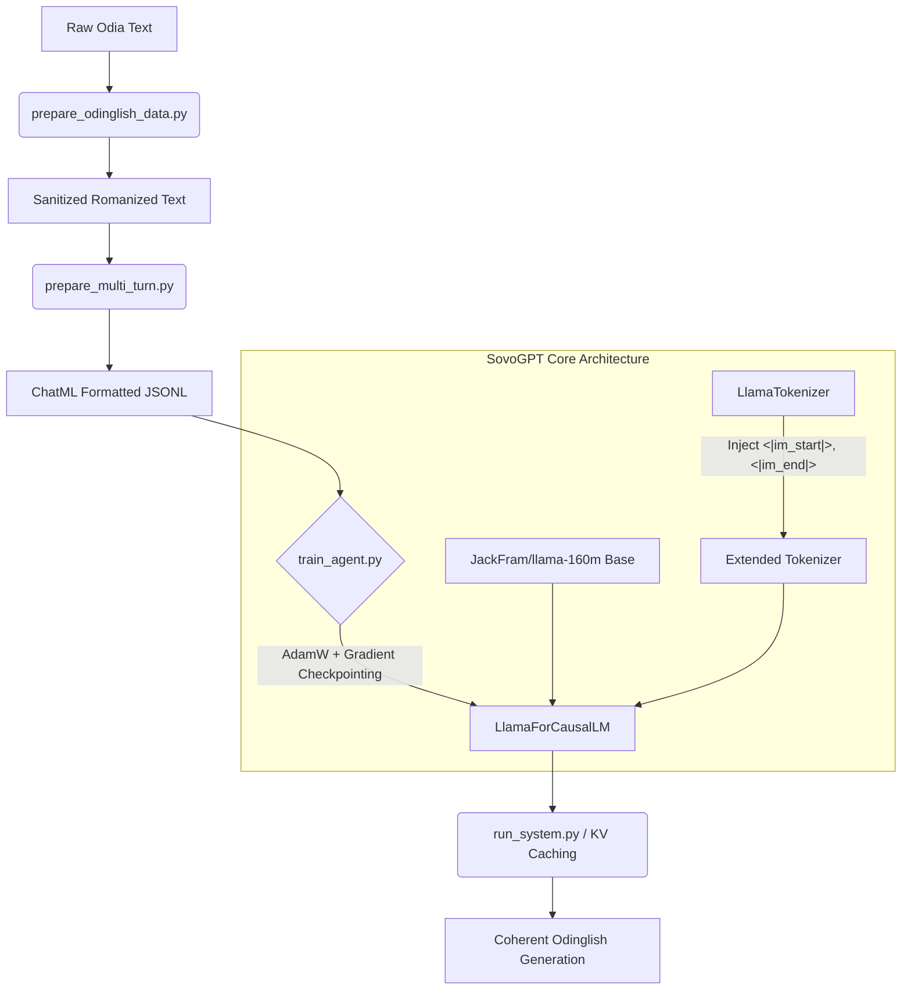

# SovoGPT: Odia Language Large Language Model

SovoGPT is an experimental repository focused on training and fine-tuning Large Language Models (LLMs) for the Odia language (specifically Odinglish - Romanized Odia) on consumer hardware. The project encompasses end-to-end tokenizer adaptation and instruction fine-tuning.

## Architecture



The underlying system utilizes a LLaMA-based causal language modeling architecture. 

- **Base Model:** JackFram/llama-160m (160 Million Parameters)
- **Architecture Type:** LlamaForCausalLM (Transformer Decoder)
- **Tokenizer:** LlamaTokenizer augmented with custom ChatML tags (`<|im_start|>`, `<|im_end|>`) and dynamically resized embeddings.
- **Optimization:** Trained using AdamW with Gradient Checkpointing to strictly adhere to unified memory constraints on MPS (Metal Performance Shaders) backends. 
- **Context Length:** Configured dynamically (256/512 tokens) to balance VRAM usage and conversational coherence.
- **Inference:** Utilizes Key-Value (KV) caching and parameterized sampling (temperature tuning, repetition penalties) for coherent, non-degenerate conversational generation.

## Project Structure
```
sovogpt/
├── README.md
├── requirements.txt
├── scripts/
│   ├── prepare_odinglish_data.py # Data sanitization and formatting
│   ├── prepare_multi_turn.py     # Q/A string conversion for ChatML
│   ├── train_tokenizer.py        # Tokenizer vocabulary adaptation
│   ├── train_agent.py            # Automated HuggingFace training script
│   ├── run_system.py             # Inference pipeline and sampling
│   └── test_eval.py              # 15-turn conversation evaluation
└── src/
    └── config.py
```

## Installation

1. Clone the repository:
   ```bash
   git clone https://github.com/sovopr/sovogpt.git
   cd sovogpt
   ```

2. Install dependencies:
   ```bash
   pip install -r requirements.txt
   ```

## Usage

### 1. Data Preparation
Format and generate the conversational ChatML dataset:
```bash
python scripts/prepare_multi_turn.py
```

### 2. Fine-Tuning
Execute the fine-tuning script. The pipeline automatically injects ChatML tokens, enables gradient checkpointing, and begins the Supervised Fine-Tuning (SFT) phase over the custom dataset:
```bash
python scripts/train_agent.py --base-model JackFram/llama-160m --epochs 3
```

### 3. Evaluation
Run the fully automated multi-turn conversation evaluation sequence to test inference context tracking:
```bash
python scripts/test_eval.py
```

## Contributing
Contributions and optimization PRs are welcomed.
